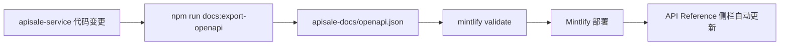

# 文档与主服务同步设计

目标：主服务新增接口或模型时，文档能**低成本、可自动化**地跟上，避免手写重复维护。

---

## 三层文档分工

| 层级 | 内容 | 数据源 | 更新方式 |
|------|------|--------|----------|
| **L1 概念指南** | Quickstart、认证、错误码、Console 使用 | `apisale-docs/*.mdx` | 人工编写，变更少 |
| **L2 API 参考** | REST 路径、参数、响应、Playground | OpenAPI（NestJS Swagger） | **CI 自动生成** |
| **L3 模型参考** | 每个模型的 schema、定价、示例、Playground | 目录 DB + `ModelPagesService` | **主站动态页**，不进 Mintlify |

原则：**模型文档不复制到 Mintlify**。Explore / 模型详情页已是权威来源；文档站只链过去。

```
apisale-service (NestJS)
├── /openapi              → Swagger JSON（已有）
├── /v1/*                 → Public API
└── /site/v1/models/*     → 模型页数据（schema、定价、示例）

apisale-docs (Mintlify)
├── docs.json             → 导航 + OpenAPI 绑定
├── get-started/*.mdx     → L1 指南（手写）
├── model-apis/*.mdx      → L1 概念（手写，链到 L2/L3）
└── openapi.json          → L2（从服务导出，CI 覆盖）

apisale-web
└── /models/[slug]        → L3 模型文档（实时）
```

---

## L2：OpenAPI 自动同步（推荐优先落地）

### 现状

`apisale-service/src/main.ts` 已在 `/openapi` 暴露 Swagger UI 与 JSON。

### 目标流程



### 实现步骤

1. **脚本** `apisale-service/scripts/export-openapi.mjs`
   - 启动应用或 `nest build` 后通过 `SwaggerModule.createDocument` 写出 JSON
   - 或 `curl http://localhost:8801/openapi-json`（若暴露 json 端点）
   - 可选：过滤只保留 `paths` 下 `/v1/*`（Public API），Console/Admin 不进开发者文档

2. **根目录 npm script**（monorepo 若有）或 service `package.json`：
   ```json
   "docs:export-openapi": "node scripts/export-openapi.mjs --out ../apisale-docs/openapi.json"
   ```

3. **CI**（PR / main）：
   ```yaml
   - run: npm run docs:export-openapi -w apisale-service
   - run: git diff --exit-code apisale-docs/openapi.json  # 未提交则失败
   - run: npx mintlify validate
   ```

4. **Mintlify 配置**（`docs.json`）：
   - 全局 `"api": { "openapi": "openapi.json" }`
   - 导航组 `"group": "API Reference", "openapi": "openapi.json"` → 端点页自动生成

5. **Controller 标注**：新接口加 `@ApiTags('Public')`、`@ApiOperation`、`@ApiResponse`，Swagger 即完整。

### 开发者体验

- 加新 Controller → 跑 export → PR 里 `openapi.json` diff 可见
- Mintlify Playground 自动出现新端点
- 手写 MDX 只需更新「概念页」（如 webhooks 行为变化），不必抄 endpoint 列表

---

## L3：模型文档（不进 Mintlify）

### 为什么

- 模型数量大、变更频繁（seed、供应商、定价规则）
- `ModelPagesService` 已聚合：input schema、定价档位、示例、family endpoints
- 主站 `/models/{slug}` + Playground 已是最佳阅读体验

### 文档站角色

在 `model-apis/overview.mdx` 等页面：

- 链到 [Explore](https://apisale.ai/explore)
- 说明「模型 slug = `POST /v1/run/{model_slug}` 的路径参数」
- 可选：维护**分类索引页**（手写 5–10 个 category），不维护每个模型

### 可选增强（Phase 2+）

| 方案 | 说明 |
|------|------|
| **A. 文档内嵌 Explore** | Mintlify 自定义 React 组件调 `site/v1/explore/search`（需 CORS / 代理） |
| **B. 生成模型索引 MDX** | 定时任务：`GET /site/v1/explore/search` → 生成 `models/_generated/catalog.mdx`（仅 slug + 链接） |
| **C. 主站 sitemap** | `sitemap.xml` 含所有模型 URL，供 SEO / llms.txt 引用 |

推荐 **B（低频 CI）+ 主站实时页**：文档站只生成「模型目录索引」，详情仍跳转主站。

---

## L1：指南 MDX 何时手写

仅在**产品行为**变化时更新，例如：

- 认证方式、错误码、并发档位规则
- Console 新功能区（如 Limits 页）
- Webhook 签名算法

与 OpenAPI 无关的叙事内容保留 MDX；与 endpoint 重复的表格逐步删掉，改为链到 API Reference。

---

## 仓库与发布

```
apisale/                    # monorepo（或拆仓）
├── apisale-service/
│   └── scripts/export-openapi.mjs
├── apisale-docs/
│   ├── docs.json
│   ├── openapi.json      # generated, committed
│   └── **/*.mdx          # guides
└── .github/workflows/docs.yml
```

Mintlify 监听 `apisale-docs` 目录 push 即部署。

---

## 实施优先级

| 阶段 | 任务 | 产出 |
|------|------|------|
| **P0** | `mint.json` → `docs.json` | `mintlify dev` 可跑 |
| **P1** | `export-openapi` 脚本 + CI check | 新接口自动进 API Reference |
| **P1** | Controller `@Api*` 补全 Public 模块 | 高质量 OpenAPI |
| **P2** | 模型 catalog 索引生成脚本 | `models/catalog.mdx` 每周/每次 seed 更新 |
| **P3** | `llms.txt` / `llms-full.txt` 生成 | AI 可读站点地图 |

完成 P0–P1 后，**新增 REST 接口 ≈ 零文档工作量**；新增模型 ≈ **零 Mintlify 工作量**（主站自动有页）。

---

## 与 Phase 3 的关系

Phase 3（Stripe Checkout、低余额告警等）落地后：

- Console 相关变更 → 更新 `console/*.mdx` + 必要时 Console OpenAPI 分组（若对外）
- 计费字段变更 → 更新 `get-started/pricing.mdx`，钱包字段以 `GET /v1/account` OpenAPI 为准

文档同步不阻塞 Phase 3，但建议在 Phase 3 第一个 PR 前完成 **P1 export-openapi**，避免 Billing API 再次手写两份。
